# Performance Indicators Application Functional Specification

version 0.0.0.9001 from 18-Jan-201 by
[Vladimir Turbayesky](mailto:volodymyr.turbayevsky@wano.org) (partly
based on information presented on the [DES](http://www.wano.org/Dk01Asp/dkw000.asp) and [Reports](http://www.wano.org/xwp10webapp/Confidentiality.aspx) websites)

## Abstract

It's a live document to describe the _minimal_ functionlaity of the
Performance Indicators Application, which is currently work on the
INPO servers as two apps which is DES and [Reports](#reports).

As minimum, _all_ these functions _shold_ be included into the new PI
application. Also it is necessary to include all the reporting
functions ehich are described into the
[Prototype](#prototype-functionality) section. It is the vital
condition to extend the existing DES-Reports functionality to justify
developnemt necessity.

DES was designed to enter source data, provide very basic calculation,
and to provide some security functions. Also it supports the basic
dataflow which mean review data then promote or reject them. More
detailed information regarding DES please see
[below](#data-entry-system-basic-functionality).

[Reports](#reports) provides basic reports functionality, including
reports, groups and indexes tuning. Currently the system has the
_precalculated_ results. The calculation of the results might be
started manually or automatically (every weekend).

It seems reasonable _new system to calculate all the resuls on fly_.

## Data processing

### Use of DES

The basic use of DES is as follows:

Authorized IDs enter PI data. Data can be entered, saved, viewed, and
calculated prior to submittal to WANO. Data may even be entered in advance for indicator projection calculations. (However, data cannot be submitted prior to the end of the period.)  Data entered at the unit/utility level has a green background.

Data can and should be reviewed by other utility staff prior to
submittal to WANO.  The data submittal authority is a separate
authorization from data entry.  Furthermore, while data entry
authority may be assigned to IDs by category, the assignment of
submittal authority is for all data categories, although the submitter
may elect to submit data categories at different times.  It is
recommended that initial data submittals for a new reporting period be
done for all categories at the same time. The station level submittals
are separate from unit level submittals - submitters should not forget that both submittals need to be done each period. Data that is submitted for WANO review has a yellow background.

IDs with data entry privileges may also Recall data that has been
submitted - returning the data from the review (yellow) status to the utility level (green).

After data is submitted (a due date has been established for each
reporting period - please check with your regional coordinator for the due date), the applicable WANO regional centre will review the submittals. The various results from review can be accepted, or returned to the submitter electronically. The reviewer may also elect to phone the submitter to resolve any questions. If the data is accepted, the reviewer will promote the data to production. The data will then be used in WANO calculations when the WANO system administrator calculates results. Data that is promoted (in production) has a white background.

Data can also be disqualified - a UD code is assigned to a data
element and then has a red background - or the data may be returned to the utility (the data is returned to a utility level (green) from the review status (yellow).

Results are typically calculated by WANO once a calendar quarter after all worldwide data is placed in production.

Authorized IDs may calculate any indicators value in DES for the associated unit using data in the various levels (green, yellow, or white backgrounds.)

Users with data entry, data submittal and view data authority may calculate indicator values for the associated units/stations.

The [QRR](#qrr) (Quality Review Report) may be used to identify potential data
errors. QRRs are intended to help users ensure accurate data is reported. If you receive a QRR message, you are not required to make a comment in the Data Entry field; however, a comment may help explain the data to other data users

All data fields have associated comment fields. The comment fields are
text fields that can contain up to 255 characters. _Only Roman style
characters should be used._ It is recommended that comments be
provided for unusual or significant data or data changes. WANO
reviewers have a separate comment field for WANO comments. Utility and
WANO comments are separate and cannot be modified by each other.

### About Security

In this topic you can learn the following: 

- Why is there security? 
- How DES security works 

#### Why is there security?

The DES needs security because all members access the system at the same place, the WANO Web site.  Unlike software on a desktop computer, where users must have access to a specific computer in order to view or modify station data, many members can access the WANO Web site.  Thus, Web based data is not protected by the physical location of the computer.  Instead, a security system is used to control who can view and update data for each unit.

#### How DES security works

##### Security is assigned by function and location

DES security was designed to permit users to perform many functions or only a few, depending on how a member chooses to manage the data entry process. In order to permit this flexibility, security control is divided into many functions. Users can be assigned from one to all of these functions: 

- Generation data entry - enter/update data elements needed to
  calculate planned & unplanned capability loss  and unplanned
  automatic scrams indicators 
  
- Equipment performance (safety systems) data entry - enter/update
  data elements needed to calculate safety system performance
  indicator 
  
- Chemistry data entry - enter/update data elements needed to calculate
the chemistry performance indicator 

- Fuel reliability data entry - enter/update data elements needed to
  calculate the fuel reliability indicator 
  
- Radiation protection data entry - enter/update data elements needed
  to calculate cumulative radiation exposure 
  
- Personnel safety data entry - enter/update data elements needed to
  calculate the industrial safety accident rate 
  
- View data only - view data elements for all indicators and run all
  reports 
  
- Submit data to WANO - designate station data as ready for use by
  WANO 
  
- Local administrator - assign rights to perform the functions above
  to other users in the organization 
  
The right to perform any of the above functions is assigned for specific units, stations, or organizations (such as a utility or member).

If a member wishes to assign individuals data entry responsibilities for a specific category of data they may do so by assigning data entry privileges for that category. For example, if a station performance indicator data coordinator wished to assign the chemistry department responsibility for entering chemistry data, the coordinator would configure the User ID of one person in chemistry to permit data entry in the chemistry category. That person would then be permitted to enter data in the chemistry category but not any other category. Any user authorized to enter data in one category also is permitted to view that unit's data in other categories, though they will be unable to enter or change data in other categories.

#### Local administrators assign security

In order to assign security privileges within their organization, users must have their Ids configured as a "local administrator". Local administrators can delegate any function (all or any subset thereof) they possess to any user in their organization. For example, if a local administrator has data entry, submittal, and local administrator functions for all stations in a utility, that local administrator can delegate all or some of those functions to any user in their utility. 

#### Security is administered in tiers or levels

Local administration is constructed in a tiered fashion. At the highest level, WANO Regional Center personnel are local administrators of all DES functions for every station in their region. They may delegate these privileges to any user within their region. Regional center personnel may elect to delegate local administrator privileges to one representative at each member, creating a tier of administrators that can delegate DES privileges for any station of that member. The member local administrator may delegate local administrator privileges to a representative of each utility affiliated with that member. Through this process, members can create as many or as few tiers of security administration as they wish. Listed below are some possible tiers of local administrators: 

- Regional center administrator - All data entry privileges for all
  stations in their region 
  
- Member administrator - All data entry privileges for all station of
  their organization 
  
- Utility administrator - All data entry privileges for all stations
  of their utility 
  
- Station administrator - All or most data entry privileges for a
  station 
  
- Unit administrator - All or most data entry privileges for a unit 

_Note that administrators can only delegate privileges they are assigned. For example, if data submittal to WANO is not assigned to an administrator, they cannot delegate that privilege._

## Data Entry System basic functionality

DES can be accessed [here](http://www.wano.org/Dk01Asp/dkw000.asp)
(for registered users only). Here is the main page screen.
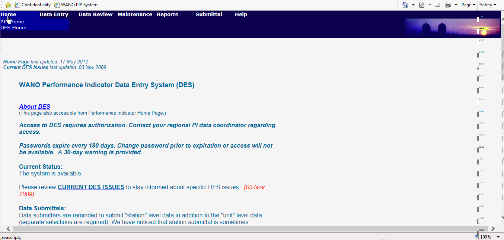

### Overall Description

The WANO Data Entry System (DES) is a Web-based application developed and implemented for WANO member units to directly enter performance indicator data reportable to the WANO Performance Indicator Programme.

The reported data is used by WANO to calculate performance indicator values.  These results are periodically posted on the WANO Web site. Results are available on spreadsheets and in Web-based PI REPORTS, both available on the WANO Web site.

DES has a Home Page that provides various programme information, reminders, and a [link](http://www.wano.org/DK01/inc/DESIssues.asp) to Current DES Issues. These all should be reviewed periodically.

### Access

The application requires access to the Internet using Internet Explorer version 5.0, service pack B, or better. If access is not currently available, a member may request its regional centres to enter its data for its units; however, it is strongly suggested that each member work towards improving its Internet access to benefit from efficient data reporting and utilization of the system features.

The system is accessed through the Performance Indicator section on the WANO Web site.  An ID and password are required to access the WANO Web site; in addition, specific authorizations must be made for the ID to perform various actions within DES. The units assigned local administrator for the performance indicator program controls those authorizations.  The WANO regional centre data coordinators initially assign the local administrator authorization. The system administrator is located in WANO-Atlanta Center. (Passwords expire every 180 days.)

### Personal Authorization

Local administrators control access to DES once an ID is assigned to the individual seeking access.

### Features

The following features are included in DES:  [Data Entry](#data-entry) (the capability to enter data into data categories); [Data Submittal](#data-submittal) (the capability to submit data after entry to WANO regional centres for review, acceptance, and processing); [Data Review](#data-review) (the capability for regional centres to review and process data submitted by members); [Data View](#data-view) (the capability to view data entered into DES); and the capability to run several types of reports.

The [Reports](#reports) include data quality reports, calculations, timeliness status, and unit pedigree information.

The system also allows local administrators flexibility in assigning authorizations to other IDs of the same organization.  [Security](#administer-security) administration can be accessed under the  [Maintenance](#maintenance) tab on the DES Home Page.

Several other features are included under the [Maintenance](#maintenance) tab that allows certain label customizations and selections. These features are suggested for advanced users.  Contact the regional coordinator regarding these features.

[Help](#help) screens are available under the Help tab but are very basic and limited. Improvements will be made as resources permit. Although print and copy capability is possible, the system is designed for electronic entry, submittal, and viewing of data, and therefore printouts may not be suitable for formal reports.

Users should review all available tabs and menu items to identify all available capabilities.

### Data Entry

Authorized users enter performance data or codes in specific categories and the related comments if appropriate. If the category field has a selectable option for the corresponding unit of measure, that selection MUST be made first, turning the data field color green, before entering the numerical value. Data with a green field is called utility data as it has not been submitted to WANO for review. Calculations can be made in DES using utility data.

### Submittal

 Authorized users submit completed performance categories for specific periods.  Any or all categories may be selected for single or multiple periods at a single time. After submittal, the data field turns yellow. Data with a yellow field is called Review level data and is available to WANO for Review and acceptance. Data at the Review level cannot be changed by the utility. It is also not used by WANO in published calculations.   Authorized users can recall (by category) data in Review to utility data level if the data needs to be changed. Calculations can be made in DES using Review level data.

A separate ID can be used to submit data in order to allow an
independent verification of data quality before data categories are
submittal to WANO.

Data submitters are reminded to submit "station" level data in
addition to the "unit" level data (separate selections are
required). We have noticed that station submittal is sometimes
overlooked. We are also investigating a software change to avoid this
problem. Some units have data revisions remaining at the "utility"
level (green).  Please remember to Submit data revisions, or Refresh
to return display to production values. "Green" data has not been
submitted and is not used by WANO.  "Red" data is not used in
calculations.

Atlanta Center Stations:
- U.S. Stations Only: Data is due per schedule established by INPO (within approximately 20-22 days after end of each calendar quarter).
- Atlanta Center International Stations: Data is due 30 days following
  end of calendar quarter.

Moscow, Paris, and Tokyo Center Stations: Data is due 60 days following end of calendar quarter.

### Review by WANO Regional Staff

 Authorized users (IDs having Submit authority) submit completed performance categories for specific periods.  Any or all categories may be selected for single or multiple periods at a single time. After submittal, the data field turns yellow. Data with a yellow field is called Review level data and is available to WANO regional staff for Review and acceptance.  Data at the Review level cannot be changed by the utility. It is also not used by WANO in published calculations.  Authorized users can recall (by category) data in Review to utility data level if the data needs to be changed. Calculations can be made in DES using Review level data.

### Calculation of Results

Under the Reports tab, a user with at least View Data authority can calculate results and display those values in one of six formats.  Depending on the criteria selected, the user can calculate results based on utility level (green) data only, or production level (white) data only, or production level data with the Review level data (yellow) where it is present, for one or more units, and one or more data periods, covering one or several time periods. Please contact your regional coordinator for more details.

### Other Features

The regional coordinator should be contacted regarding other features
that may be available or other issues not addressed in this
document. The DES Home Page may also be referenced for the latest
information on the status of DES and current DES issues.

DES added a feature in August 2002 that allows authorized users to
view the data elements that contributed to the results, trend
performance, and make comparisons for units worldwide. To use the
feature, obtain a result using the Calculate Indicator feature. When
the result is displayed, select the View Data tab. The WANO PI View
Production Data page is opened. Select the appropriate data category
and the data for the time periods of the calculated result(s) will be
displayed.

U.S. members provide data into WANO DES using Consolidated Data Entry
(CDE). (Direct entry is no longer possible.) Transfer of data from CDE
into DES places data in the green utility level; data will still need
to be submitted to WANO within WANO DES for review. Please contact
INPO CDE help line, (770) 644-8500, or WANO-AC if there are questions.

A default unit of measure has been set for all units for applicable
radiation protection and fuel reliability data.  Initial default
settings are based on 2003Q3 data; however, members may change the
default setting by using the unit label customization feature of DES.
(Authority for label customization is required.)  Contact your
regional data coordinator if you have questions.

Attention U.S. members:  Some computer checks existing in DES are not in effect for U.S. members due to direct transfer into DES from CDE.  Please do not depend on computer checks to ensure data accuracy.

_NOTE: If more than one result was generated, all the applicable data periods will be displayed._

### KPIs

World Wide Key PI Reference Values - WANO has established long-term
2015 reference values for collective radiation exposure, forced loss
rate, industrial safety accident rate, and safety system performance
indicators. These values can be displayed as an option on applicable
summary and trend reports from the WANO PI REPORTS application. See
the Performance Indicators Page and the PI REPORTS application for
more information.

### Reference Manual

The PI reporting guidelines/definitions document is only available
on-line and is now referred to as the WANO PI Reference Manual
(formerly IG 19.1, Annex 1).  SSPI definitions are now provided by
reactor type.  (Chapters may be viewed on-line, or downloaded and
printed.)

### Data Entry (top menu)

The home page provides access to each of the DES modules. The area
beneath the menu bar is used by WANO to provide news and information
to DES users.

#### Home

Home - Two options are available:
- PIP Home -This option returns you to the Performance Indicator home page on the WANO Web site
- Home - This option returns you to the DES home page

#### Data Entry

The very first menu is Data Entry
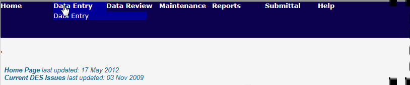

The Data Entry page is your platform for entering raw data from the units for which you are responsible. If responsibility for entering data is shared with other personnel, your authority to perform data entry may be restricted to one or more performance indicator categories and/or units. You will need to verify your specific assignment(s) with your performance indicator coordinator.

This tab designed to enter the source data and to check data status
accordingly to the [Data Processing](#data-processing). The main data
entry window lokks like the following
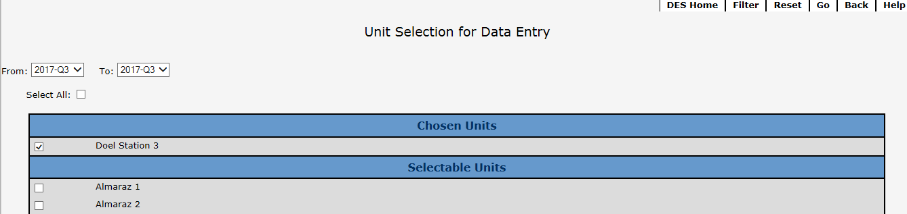

When first opened, the units and time periods selected for data entry are displayed. Additionally, the six data category tabs are displayed for selection. Clicking a data entry tab displays the data form for that category.

After unit selection ([filters](#filters) are applicable) we can see
the data category selector as following
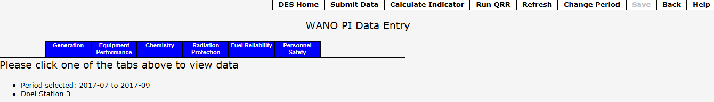

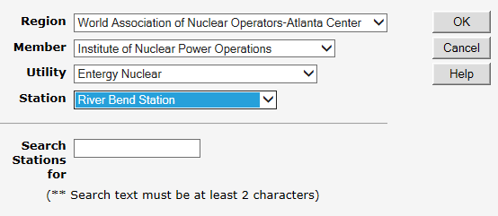

Then we can see the data for each category 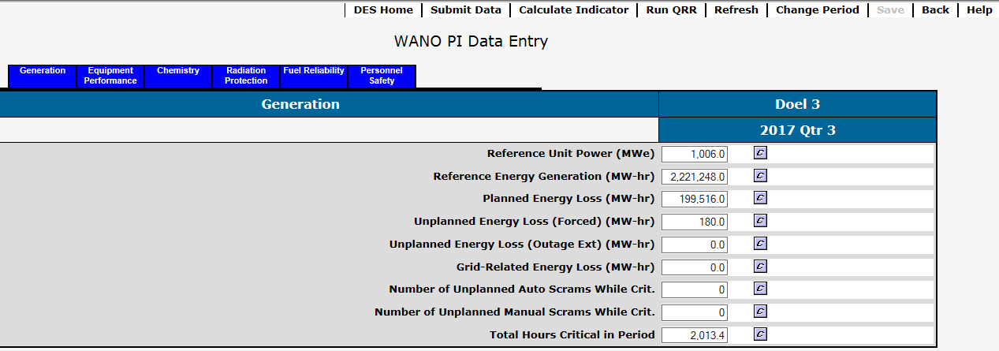

_Please note that all the data in this manual are faked_

##### Data Status

Data resides in one of four virtual views. These views are color coded to help users identify their status: 
- Utility - Data entered by a station but not submitted to WANO for use in performance indicator program. WANO does not use or view this data until the station submits it. The cell background will be green.
- Review - Data submitted by a station to WANO but under review by a regional center. The cell background will be yellow.
- Returned - Data submitted to WANO but not accepted to the production database. It was returned to the station for revision. The cell background will be red.
- Production - Data that has been reviewed by WANO and promoted to the production database. This data is used for calculating the performance indicator values displayed on the WANO Web site and published in WANO reports. The cell background will be white.

So, the white backgroung below the data entry fiend means that data has
been promoted (see the [data processing](#data-processing) for
details). Yellow backgroung means data has been received from data
promoter, and green one means data has been sent from data promoter
but didn't submitted yet.

It is _extremly important_ user to add the [comments](#comments) as shown below for
all the data which is reflected into the [QRR](#qrr)
report. 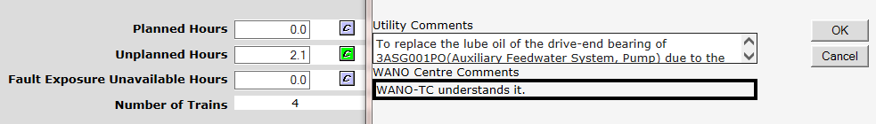
If the comments exist, the colour of the 'C' button is green.

##### View and Enter Data

If you have authority to enter or update data for given category and
unit, data entry cells will be displayed on the form. If you only have
authority to view data for a category or unit, the form will display
data in a table without data entry cells.

#### Using the Page

The blue tabs under WANO PI Data Entry represent the six performance indicator categories. Click on the Generation tab for an illustration of the steps involved in performing data entry.

##### Entering Data

1. Click the blue category tab in the WANO PI Data Entry window.

_Note: The unit names and the time period you have chosen previously
are already filled in for you. The Reference Unit Power is
automatically filled if the previous period contains this data. If the
Reference Unit Power is filled, Reference Energy Generation will be
calculated based on the hours in the time period times Reference Unit
Power. This auto fill feature is used on a small number of fields that
are likely to remain the same from time period to time period._

2. Definitions for the remaining data to be entered can be found on the
performance indicator definitions page.

3. To enter data, click in the appropriate cell and begin typing. For
instance, September 2000 Planned Energy Loss for Byron 2 would be
placed in the last cell of the third data row.

4. Once you have moved to a new cell for data entry, the previously
completed cell will display green, which means that data has been
entered by the unit and is only viewed by the station prior to being
submitted to WANO.

5. Continue in this fashion until you have entered all the desired data. 

_Note: For some data categories, such as Chemistry and Fuel Reliability, it is not appropriate to report data when the unit is shut down. During such time periods, you may enter the letters "DN" into the data entry field to denote that accurate data could not be collected because the unit was shut down. The "DN" will be move from the data entry cell to the code field next to the cell when your cursor leaves that cell._

_In the event that you are unable to collect data for any other
reason, you may enter the letter "X" in a data entry cell to denote
that the data is unavailable. This code should be used sparingly and
should be corrected as soon as the data becomes available._

6. To enter data in another performance indicator category, click on the appropriate blue tab.

##### Comments

1. To enter a comment in a cell, click on the "c" icon and the Enter/Update User Comments dialog window appears. Enter your comments in the Utility Comments box and click OK to return to the data entry form. If a comment has been entered the "c" icon is highlighted in a bright green color when you return to the data entry form.

_Note: There is a response box called "WANO Centre Comments" where
WANO Regional Center personnel may enter comments about the data._

2. To save the data you have entered. Click on the Save button at the
top of the window.

3. After saving your data, you may use any other of the function buttons above, as previously described.

##### Submit tab

Going to the Submit tab data promoter can select the units which data
to be send to the Regional Centres for cheching and promotion. The
data selection menu is the
following. 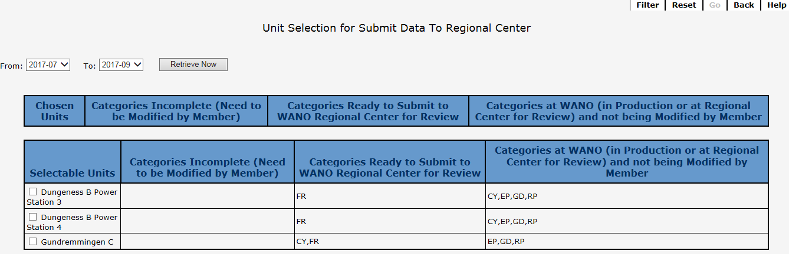

_Do NOT_ forget to press _Save_ button wheb operation completed.

##### Indicator Calculator

It is also possible to calculate indicators before data
submitting. The unit selection menu looks like selector in
[DES](#data-entry) above, but then you can choose the indicator report
criteria as shown
below. 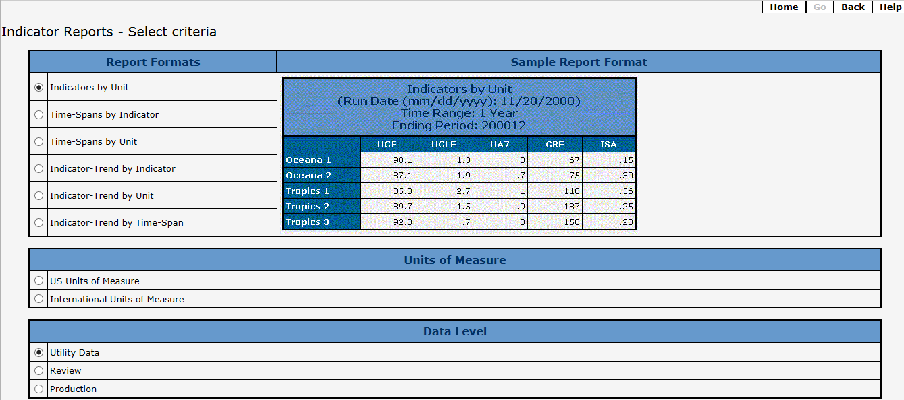

Then you have to choose the final
criteria. 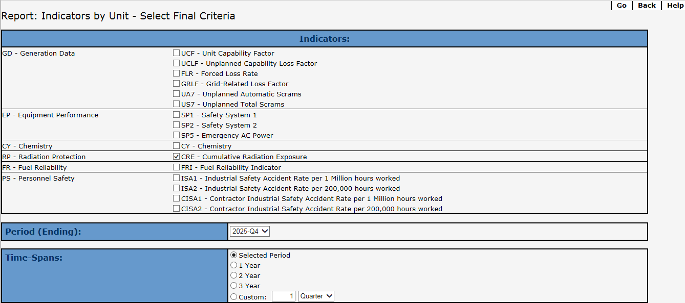

Then the calculated indicator will be
shown. 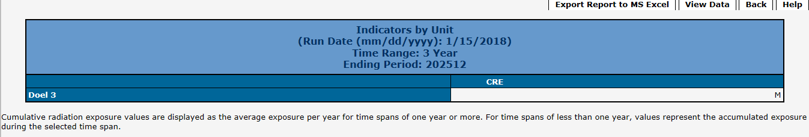

By pressing 'View Data' you'll be redirected to the
[source data entry](#data-entry) window as above.

##### Run QRR

QRR is the extremely important and useful instrument to double check
if all the data are correct and have not anomalies. Pressing 'Run QRR'
(Quality Report Review) you'll see the window as
below. 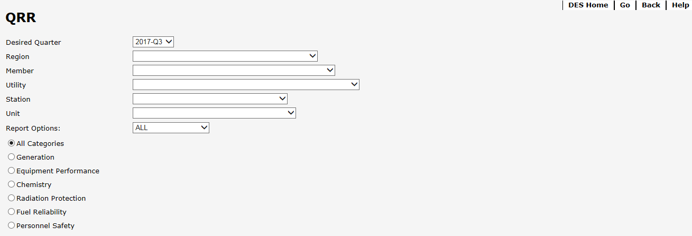

The _Report Option_ are the following:
- All
- Missing data
- Range Checks
- Consistency check

Pressing _Go_ we can see the cheching result as follows 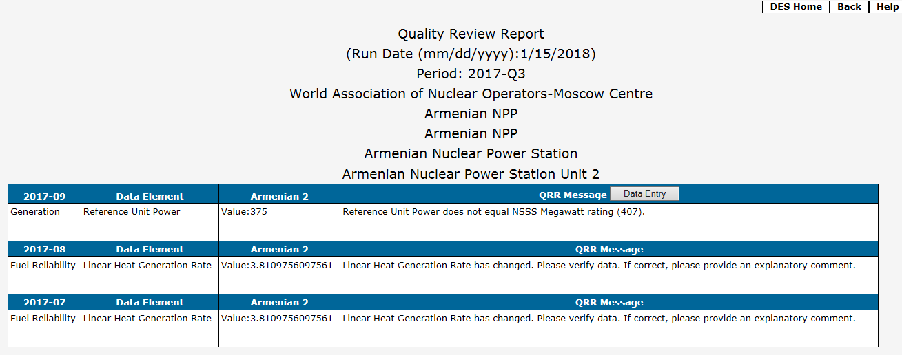

### Data Review

#### Review Data

The second one is Data Review 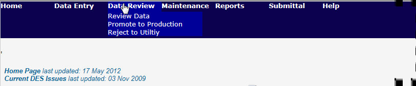

After pressing the _Go_ button data will be submitted to the Regional
Centres for double-checking and
promotion. 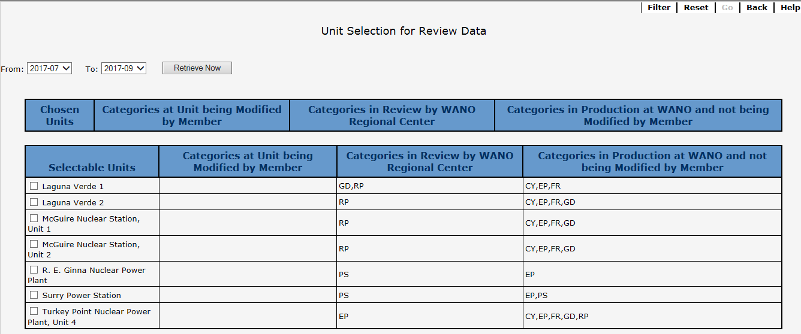

Then all the source data can be
reviewed.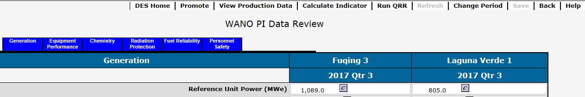

In the menu there are option to promote (see
[Data Processing](#data-processing)) data, to see the production data,
or to [calculate](#indicator-calculator) indicators or to run
[QRR](#qrr).

#### Promote to Production

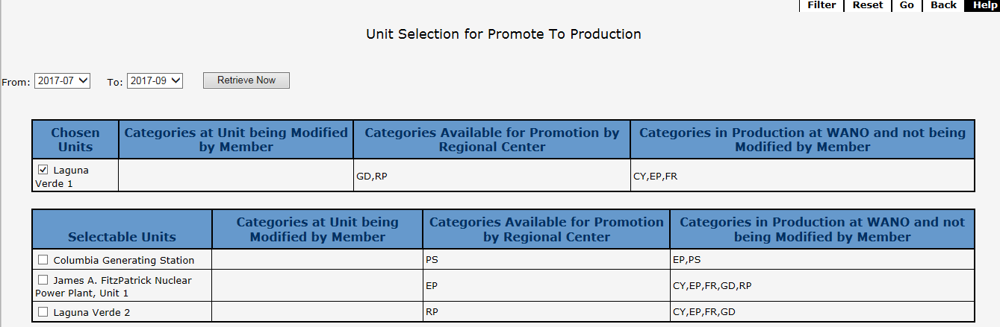
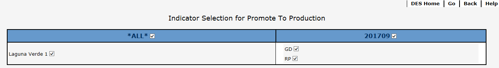

#### Reject to Utility

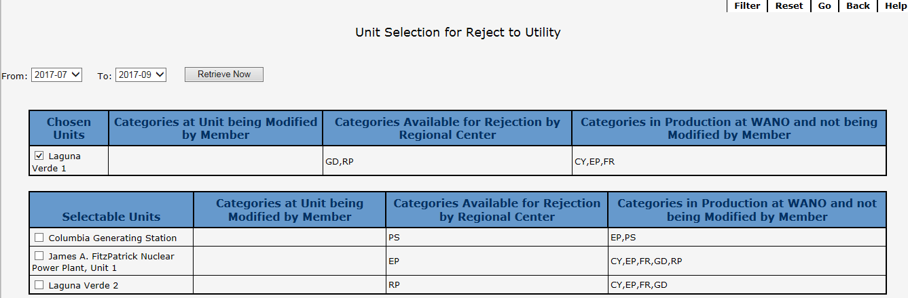

### Maintenance

Maintenance - Two options are available for members:
- Administer Security
- Unit Label Customization
  - Permits your unit labels to be customized
  - Data value range check values can be updated for each data entry field.

#### Codes Maintenance

##### Measurement Codes

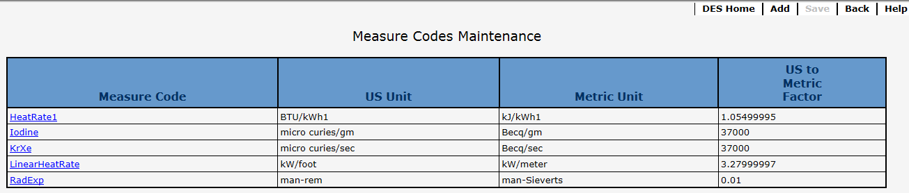
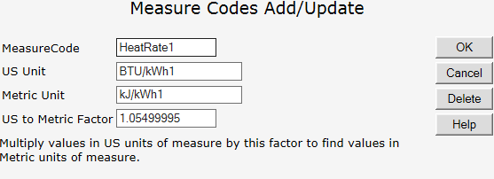

##### Category Codes

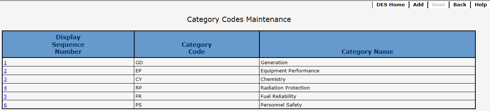
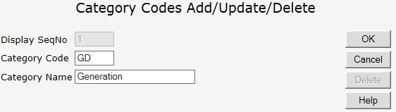

##### Element Codes

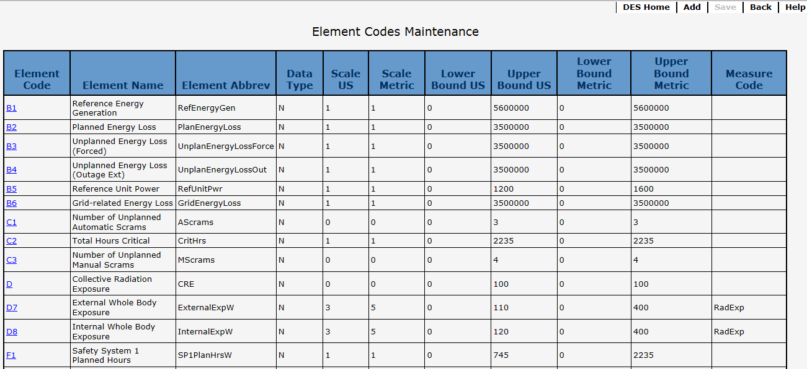
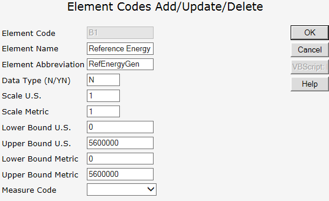

##### Label codes

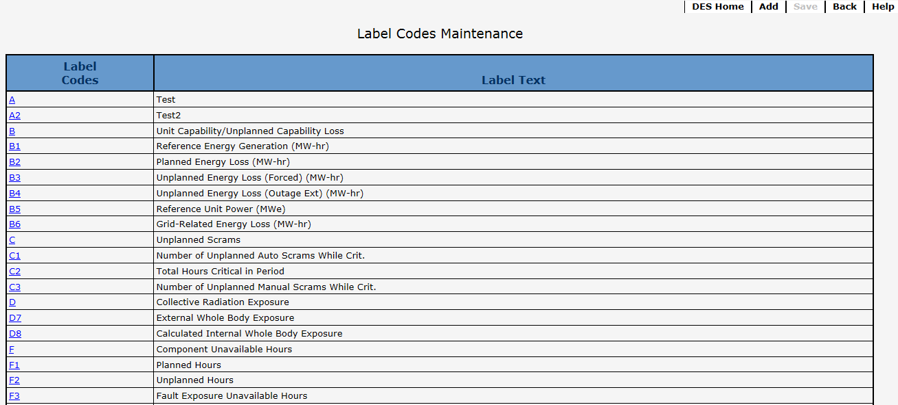
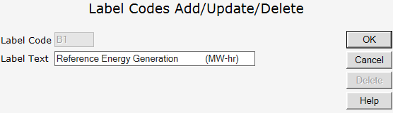

##### Category Group Codes

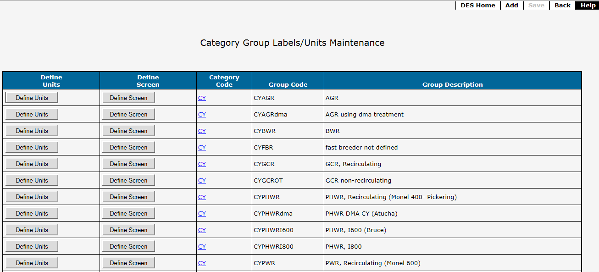
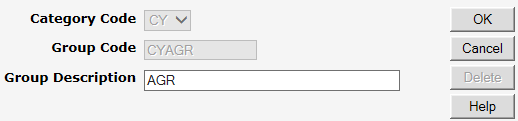

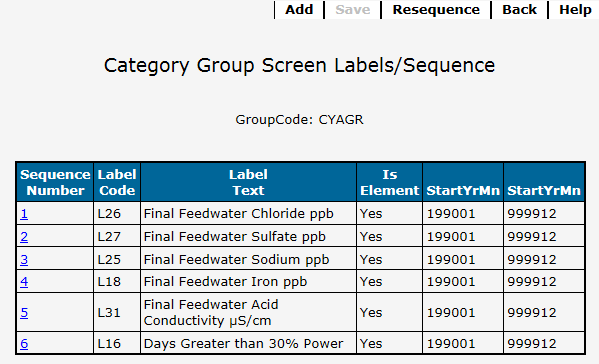
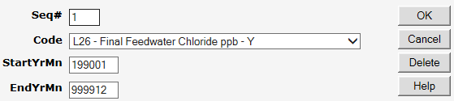

#### Data due dates

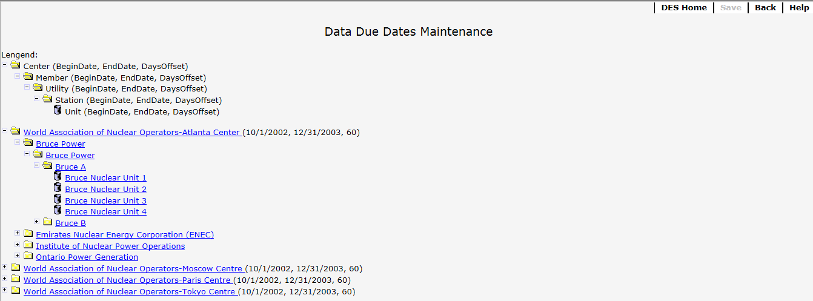
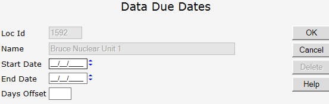

#### Indicator Eff. Dates

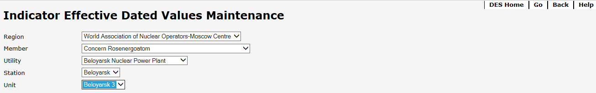
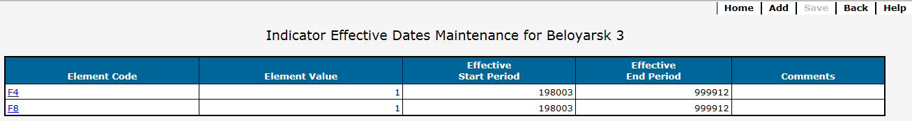
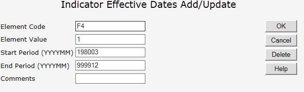

#### Unit Label Customisation

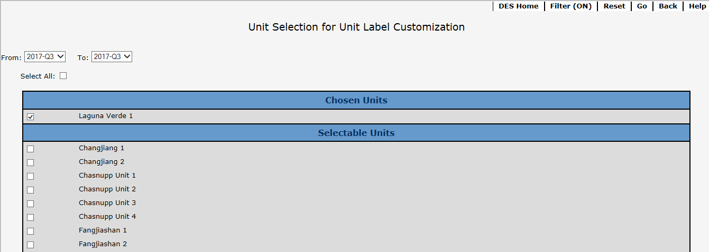
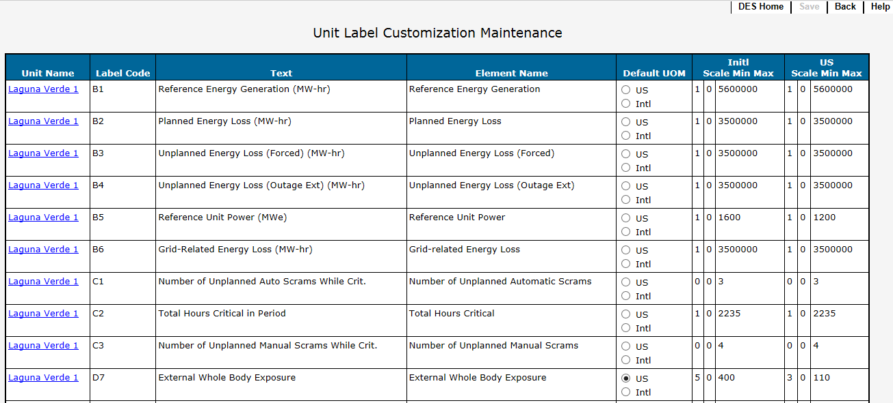
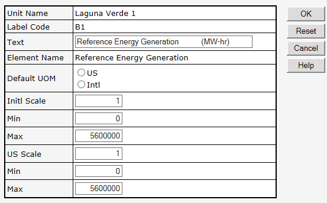

#### Sync Data Elemnts to the DK

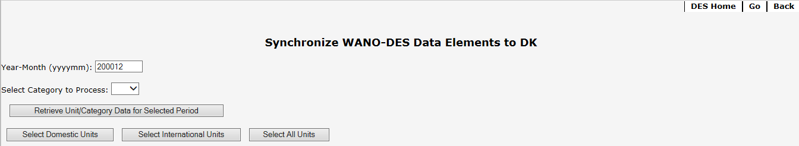

#### Promote Failure Report

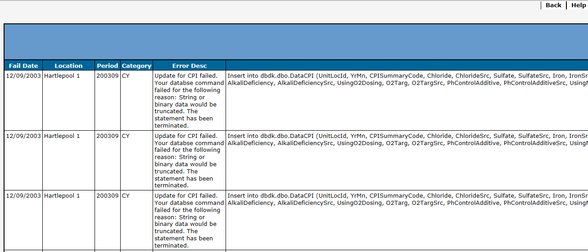

#### Administer Security

The basic information about security please see [here](#about-security).

_Please note that security mode is only available in F12 emulation
Document Mode 5 only._ 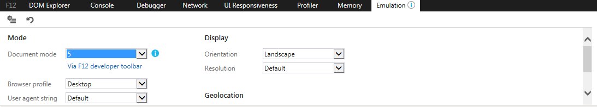

_Note: the advanced Security Application is now in the trial operation_

##### Purpose

This is the main menu of the DES security system. From this menu you may administer security by user or by function. More general information on how DES security works is available on the following page.  Reports also are available regarding the assignment of data entry functions in your organization.

##### Using the Page

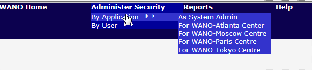
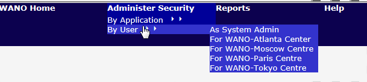
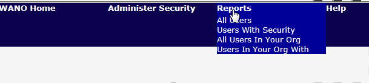

###### Administer Security by User

From the security menu click on "Administer by User" and then click on
the menu options below, which will be "As 'entity name'".  "Entity
name" will be the name of the organization, station, or unit for which
you are a local administrator.

This page enables local administrators to change the DES privileges of an existing user or to add and assign privileges to a new user.

####### Page Elements

A list of User Ids in your organization that are already configured for the DES are displayed. You have two choices: 

- Add a new user 
- Update an existing user 

This page also displays a dialog box that is used to find users by their name, UserID, or organization.

####### Using this Page

######## Add a new user

Click "Add" in the upper right hand corner of the page. A search form will appear that permits you to search for users by: 

- Name 
- Organization name 
- User Id 

Add User Dialog Box Select UserID Dialog Box 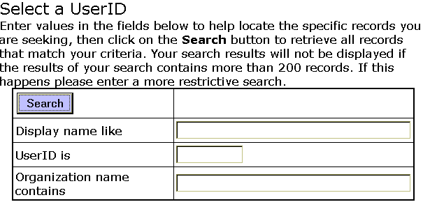

Enter your search criteria and click the search button. If your search is successful, one or more User Ids will be listed below the search form. Select one of the Ids using the checkbox to the left of each Id. 

Add User Search ResultsAdd User Search Results 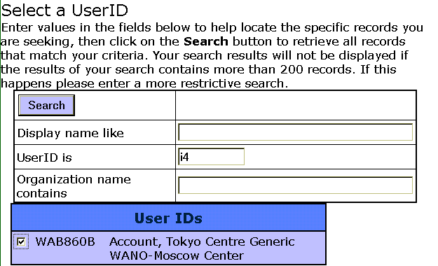

The administer function form will be displayed.

######### Administer Functions by User

This page enables local administrators to change the DES privileges of an existing user or to add and assign privileges to a new user.

########## Page Elements

The form below will be displayed for updating the users security privileges. This form lists the privileges you are permitted to assign to other users.

Administer Functions Form 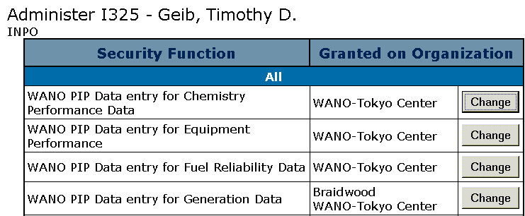

########## Using the Page

Clicking on any change button will produce a list of organizations, stations, or units for which you can delegate the selected function.

Organization List 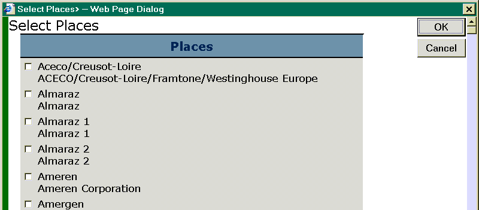

Select the entities you wish to delegate for that user using the check box to left of each entity. Selecting an organization authorizes that function for any station and unit in that organization. Similarly, selecting a utility authorizes that function for any station and unit in that organization. Selecting a station authorizes that function for all units at that station. Selecting a unit does not authorize that function for other units at the associated station, utility, or member.

After you complete selecting entities, click "OK" to return to the list of privileges for that user. If you are finished, click "Save" in the upper right hand corner of the page. If you wish to continue delegated privileges, you may click "Save" later. NOTE: If the "Save" button appears in black letters, unsaved changes remain to be saved. If the "Save" button is gray, all changes have been saved.

_NOTE:  Certain functions, such as data entry, require the ability to at least view station level data even if the user only is authorized data entry for a single station at a unit.  For this reason, users that are assigned privileges for a single unit should also be assigned "View" data privileges for the associated station._

When you are finished assigning security privileges, you may return to earlier pages using the "Back" button on your browser or on the top right portion of the page.

######## Update an existing user

In the list of User Ids already configured for your organization,
click on the User's ID next to the User name (Each User ID in the list
is a hyperlink). The form  for updating the user's security privileges will appear.

To change the scope of data entry privileges for the user, click change and continue as you would for adding a new user. To remove privileges for a User ID, uncheck boxes next to organizations, stations, or units.

###### Administer Security by Function

From the security menu click on "Administer by Function" and then
click on the menu options below, which will be "As 'entity name'".

This function is intended primarily for use by regional centers for monitoring the assignment of key DES functions.  As such, we recommend that you perform most of your DES security administration "by User" instead of "by Function".

###### Reports

Two reports are available for administering security: 
- [All Users](#all-users-in-organization-report) in your org - lists all users in the organizations for which your are able to administer security.
- All Users in your org [with security](#users-with-privileges-in-your-organization-report) - lists all the DES capabilities
  of each ID in your organization that has DES privileges
  
  
####### All Users in Organization Report

######## Purpose

This report shows all User IDs assigned to personnel in your
organization. You can delegate DES privileges to these User IDs. 

######## Page Elements

The list of User IDs is presented at the summary level, which is
signified by plus signs next to organization names. User IDs are
sorted by WANO Regional Center, WANO Member, utility, station, and
unit. 

######## Using the Page

Clicking on a plus sign will expand the User ID list to display the
next level of detail. Continue clicking plus signs to get down to the
unit level. User IDs are displayed beneath the organizational level to
which they are assigned. A minus sign indicates all detail is
displayed at that level. Click the minus signs to compress the list. 

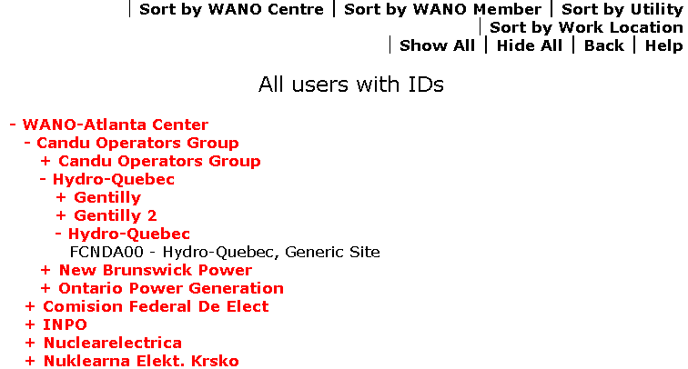

####### Users with Privileges in Your Organization Report

######## Purpose

This report shows all User IDs with DES privileges in your
organization. All data entry privileges for each User ID can be found
in this report.

######## Page Elements

Information is presented at the summary level, which is signified by
plus signs next to organization names. User IDs are sorted by WANO
Regional Center, WANO Member, utility, station, and unit. 

######## Using the Page

Clicking on a plus sign will expand the User ID list to display the
next level of detail. Continue clicking plus signs to get down to the
unit level. User IDs are displayed beneath the organizational level to
which they are assigned. A minus sign indicates all detail is
displayed at that level. Click the minus signs to compress the list. 

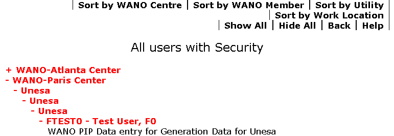

### Reports

Reports - The following reports are available:
- QRR
- Calculate Indicators
- Reporting Timeliness
- Pedigree Data Review

#### Purpose of the Page

This page is used to select the units to be used in several report modules. The title of each page will identify the report for which the unit selection page is being used.

#### Page Elements

1. Up to six drop-down lists may be used to define the desired quarter and station or unit that will be selected. The core report selections (values that are common to each of the reports) will Be Region, Member, Utility, and Station. The example below depicts the available selections for Pedigree Data Review. This report is a review of pertinent operating and design data.

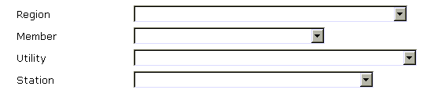

2. Selection will be made through use of the drop-down menus.

_Note: Only the locations for which you are authorized to enter data
will be represented in the drop-down menus._

	- Click on the down arrow to the right of the Region cell and select the appropriate region.
	- Click on the down arrow to the right of the Member cell and select the desired member.
	- Click on the down arrow to the right of the Utility cell and select the utility.
	- Click on the down arrow to the right of the Station cell and select the station.

3. After these four selections have been made, the options will differ according to the type of report you are creating. 
For instructions on how to generate a specific report, click on the appropriate link below. 

Timeliness Report - This report provides data for users to assess the punctuality of data provided to the regional centers. Data that is submitted to the appropriate WANO regional center in accordance with the associated Due Date (30 days from the end of the report quarter for Atlanta Center and 75 days for other centers) is deemed to be Timely. 

Completeness Report - The report offers an additional selection value, Desired Quarter, so that a specific time frame can be chosen. This report helps Users determine the status of reporting of performance indicators by WANO members, and shows the amount of data that has been submitted by the station and reviewed and accepted by WANO.

Quality Review Report (QRR) - The QRR Report checks your work for errors in the areas of completeness, range, and consistency before submitting the data to WANO. You may generate a report for each of six attributes, or specify that all are checked in one report.

Pedigree Data Review - The purpose of the Pedigree Data Report is for users to determine pertinent operating and design basis data about WANO member stations.

#### QRR

There are four Quality Review Reports: 

1. Missing Data Report

	- points out all the cells in a given date range that have not been filled in.

2. Range Checks Report

	- captures the instances of entered data falling outside the expected range (too low or too high) for a specific data element. The data reporter can then decide if the questionable value is correct, or if the value should be adjusted.

3. Consistency Checks Report

	- highlights the cells that are not consistent with the rest of the data being submitted, giving the data coordinator the opportunity to explain the discrepancy or make the necessary adjustments to the data in question.

4. All

	- is a combination of the three above reports.

##### Page Elements

You have seen how to make the core report selections of Region, Member, Utility and Station (see Unit Selection-Reports Help) by using the arrows to view the drop-down menus. 

_Note: Only the locations for which you are authorized to enter data will be represented in the drop-down menus._

 To complete the Quality Review Report set-up, eight additional values and four report options have been added for selection: 

- Time Period 

- Category and Quality Check Selection 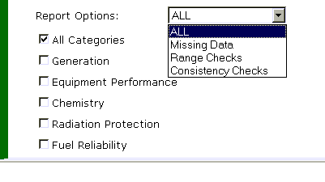

##### How to Use This Page

1. If you click the Unit arrow, the report will provide detailed data
   for each unit identified for that station. 
   
2. Use the check boxes to choose the data categories for which you
   want to measure completeness or choose All to view all categories.
   
3. Click on the down arrow to the right of Report Options: and you
   will see that four report types are available:
   
   - Missing Data
   - Range Checks
   - Consistency
   - All

Follow these steps for each of the four reports listed above.

4. Click Go, and the requested Quality Review Report will be generated. 

_Note: The All report option has been selected; thus, the example below depicts a consolidated report._

Quality Review Report 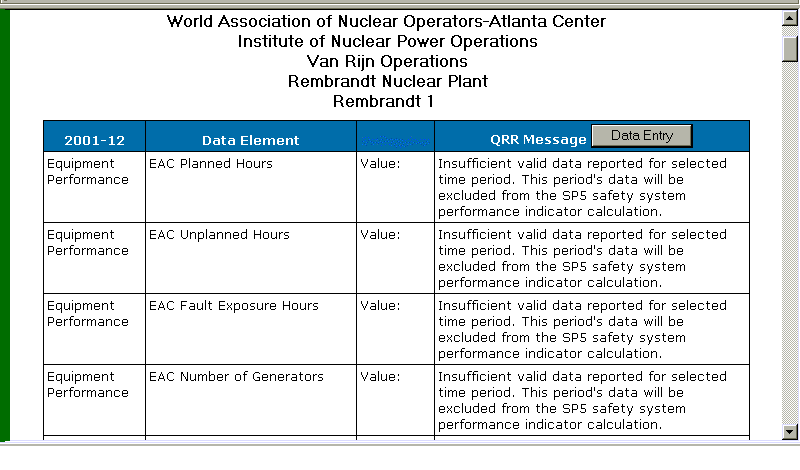

5. Beginning with the first month of the selected quarter, the report
   will display, from left to right:
   
   - the data category
   - the data element
   - the data element value
   - QRR message explaining why the value is in question
   - Click on Data Entry to display the data entry page and change the data value or provide an explanatory comment
   - After you have made the necessary data changes, you may return to Reports/QRR and generate a new report. 

#### Calculate Indicators

This is the first of two pages used to calculate WANO performance indicator values for any unit for which you are permitted to enter data or view data. It is preceded by the unit selection page, where you specified the units to be used in the calculations.

##### Page Elements

The forms on this page are used to select the report format.

##### Using This Page

1. In the Select Criteria screen, there are six selections under Report Formats:
   - Indicators by Unit
   - Time Spans by Indicator
   - Time Spans by Unit
   - Indicator Trend by Indicator
   - Indicator Trend by Unit
   - Indicator Trend by Time Span

Select Report Type Form 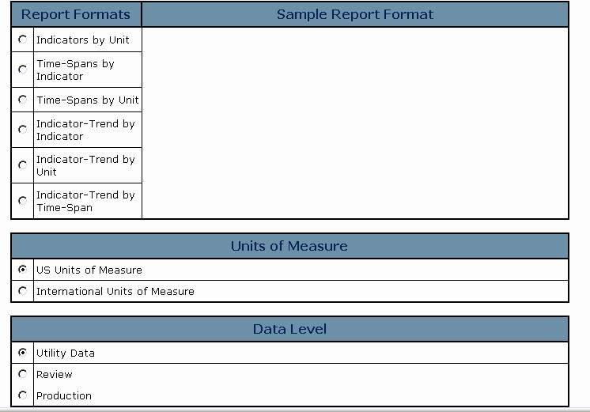

_Note the frame to the right of the report formats._

2. When you select a report format by clicking on the radio button to
   the left of the format name, a preview of the format will appear in
   the frame adjacent to the format selection. In the example below,
   Indicator-Trend by Indicator has been chosen.
   
3. Under Units of Measure, US Units of Measure has been selected.

4. Under Data Level, Utility Data has been chosen.

Example of Report Format Display 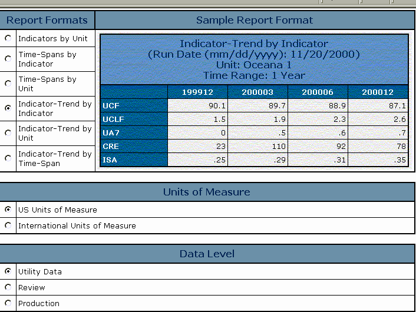

5. Click on Go and the Report: Indicators by Unit - Select Final
   Criteria screen will be displayed.
   
This is the second of two pages used to calculate WANO performance indicator values for any unit for which you are permitted to enter data or view data. The select report format page precedes this page, where you specified the format of the calculation results.

##### Page Elements

The top form on this page is used to select the indicators that will be calculated. Some report formats only permit calculating one indicator value. For those reports you will receive a warning message if you attempt to pick more than one indicator.

The second form selects the period end data or range of period end dates. Period End date is the last period in a range of periods used to calculate an indicator. For example, a one-year indicator value with a period end date of 2000-Q1 is calculated using the indicator values for 1999-Q2, 1999-Q3, 1999-Q4, and 2000-Q1. For trend reports, indicator values are calculated for a series of periods with consecutive end dates. For these reports, two Period Ending dropdown lists are used to select the series of consecutive period to calculate.

The final form on this page specifies how many time periods will be used in a calculation. 
- Selected Period - Only data from a single period is used in the
calculation. 
- 1 year - One year's data, ending with the period end date are used in the calculation.
- 2 year - Two years' data, ending with the period end date are used in the calculation.
- 3 year - Three years' data, ending with the period end date are used in the calculation.
- Custom - Specify the number of periods used in the calculation.

Final Criteria Form 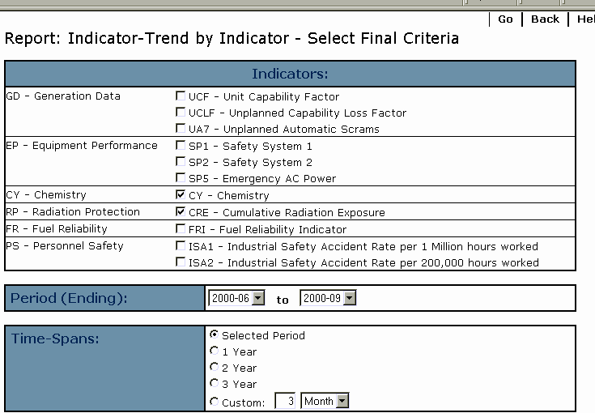

##### Using this Page 

1. In the example above, under Indicators: Chemistry and Cumulative Radiation Exposure have been selected by clicking on the boxes directly to the left of CY and CRE. 
2. Under Period (Ending): 2000-06 to 2000-09 (June 1, 2000 through September 30, 2000), and Time Spans: Custom: 3 Months have been selected.
3. Click on Go and the report that you have designed will appear.

#### Reporting Timelines

##### Purpose of the Report

This report provides data for users to assess the promptness and punctuality of data provided to the WANO Regional Centers. Data that is submitted to the appropriate WANO Regional Center in accordance with the associated Due Date (30 days for Atlanta Center and 75 days for other Centers from the end of the Reporting Quarter) is deemed to be Timely. 

##### Page Elements

You have seen how to make the core report selections of Region, Member, Utility and Station (see Unit Selection-Reports Help) by using the arrows to view the drop-down menus. 

_Note: Only the locations for which you are authorized to enter data will be represented in the drop-down menus._

To complete the Timeliness Report set-up, two additional values have been added for selection: 
- Time Period 
- Unit Detail 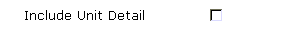

##### How to Use This Page

1. After you have made the core report selections (Region, Member,
   Utility and Station), click on the down arrow to the right of the
   Desired Quarter cell and select the calendar quarter desired for
   review.
   
2. If you desire detailed data for each unit identified for your
   Station, check the Include Unit Detail box. This will allow you to
   view statistics for individual units.
   
3. Click Go, and the Timeliness Report you have designed will be
   generated. Untimely units will be listed under the identification
   banner.
   
_Note: Data submittal dates were not recorded before 2001. As a result, this report will be valid only for reporting periods in the year 2001 or later._

#### Pedigree Data Review

The Pedigree Data Report allows individual users and WANO Regional Centers to determine pertinent operating and design basis data about WANO member stations.

##### Page Elements

1. You have seen how to make the core report selections of Region,
   Member, Utility and Station (see Unit Selection-Reports Help) by
   using the arrows to view the drop-down menus. 
   
_Note: Only the locations for which you are authorized to enter data will be represented in the drop-down menus._

Core Location Selection Elements 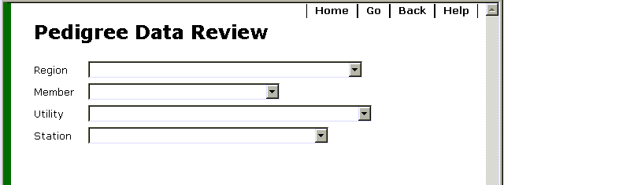

2. Click on Go, and the requested Pedigree Data Report will appear. (See example report below.) 

Pedigree Report 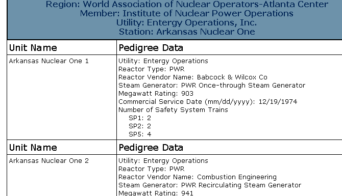

#### Data Readiness

##### Purpose of the Report

This report shows the percentage of fields containing data in the WANO production database for selected time periods and categories. This percentage indicates how well stations have been able to fulfill their performance indicator data reporting commitment. 

##### Page Elements

You have seen how to make the core report selections of Region, Member, Utility and Station (see Unit Selection-Reports Help) by using the arrows to view the drop-down menus. 

_Note: Only the locations for which you are authorized to enter data will be represented in the drop-down menus._

 To fill out the Completeness Report set-up, eight additional values
 have been added for selection: 
 
- Time Period 
- Category Selection 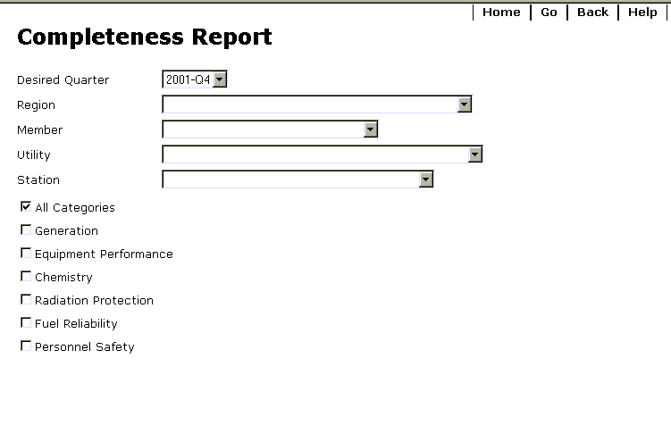

##### How to Use This Page

1. After you have made the core report selections (Region, Member,
   Utility and Station), click on the down arrow to the right of the
   Desired Quarter cell and select the calendar quarter desired for
   review.
   
2. Use the check boxes to choose the data categories for which you
   want to measure completeness or choose All to view all categories.
   
3. Click Go, and the Completeness Report you have designed will be generated. 

### Submittal

Use this module to submit or recall data from your WANO regional
center. Two options are available:

- Submit Data To Regional Center
- Recall Data from Regional Center

#### Submit to Regional Centre

This page is used to select data to be submitted or recalled from your
WANO Regional Center. Data is submitted and recalled in increments of
unit, category, and time period. You may select data for as little as
one unit, one time period, and one performance indicator category or
many units, time periods, and categories. 

The page title indicates whether this page was entered from the submit or recall option on the home page menu. 

##### Submit Page Elements

Two drop down lists are used to select the range of data to be searched for data available for submittal. Tables contain three columns showing data status: show which categories have sufficient data to be submitted and which categories are missing data (and cannot be submitted). Additionally, data that is in review at the WANO regional center also is shown. 

###### Categories Ready

Shows categories that have had utility level data that has been entered and not been submitted to WANO. Additionally, all fields in the category are complete. 

###### Incomplete Categories

Shows categories that have utility level data but some fields are blank. Categories cannot be submitted with blank data fields. 

###### Categories Submitted

Shows categories successfully submitted to your WANO Regional Center and in Review status. 

###### Category Abbreviations

- GD (Generation Data)
- EP (Equipment Performance)
- CY (Chemistry)
- RP (Radiation Protection)
- FR (Fuel Reliability)

#### Recall from Regional Centre

The elements on the Recall page are similar to those on the Submit page, however some meanings are different. The Category Ready column now indicates data in Review status at the regional center that is available to recall. The Categories Recalled column indicates data that has been successfully recalled from the regional center.

Submit/Recall Page Elements 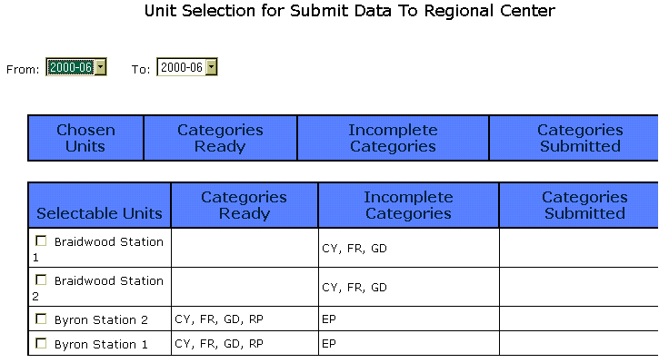

##### Using the Page

###### Date Field

Before selecting the desired units, it is first necessary to select a
date range. Note: The nomenclature for this field is YYYY-MM 

- Click on the arrow in the From: menu and highlight the desired year-month. (This field is defined as the first day of the selected month.)
- Next, click on the arrow in the To: menu and highlight the desired year-month. (This field is defined as the last day of the selected month.)

###### Selectable Units

_Note: In the above screen, the user will notice there are no units
 selected._
 
_Note: All stations for which your ID has authority to submit data will be listed under the Selectable Units list box._

By clicking on the box to the left of the identified unit, that unit will be selected for placement in the Chosen Units table for submittal to the WANO Regional Center.

###### Chosen Units

_Note: Notice that selected units move from the selectable table to the chosen table._

Click "Go" to process your selection.

### Help

Three kinds of help are available

#### PIP Definitions

A link to the performance indicator definitions page.

#### User Priviledges

Display User functions that are authorized.

#### View Help

Instructions for using DES

## Reports

To access to the Report System you've to use
[this](http://www.wano.org/xwp10webapp/Confidentiality.aspx) link.

The PI REPORTS application on the Performance Indicator Web page allows users to obtain results, trend performance, and make comparison for units worldwide. Trend charts and summary tables can be viewed, copied, saved and printed.  WANO PI REPORTS is a time-saving and informative supplement to DES and the Microsoft Excel results spreadsheets.

The Report System is designed to provide all kind of the precalculated
results and reports based on PI Programme needs. Howevew, the list of
indicators and reports is slightly out of dates, therefore you have to
realise all the additional functionality described in
[Prototype](#prototype) section below.

The design of the Report System is similar as
[DES](#data-entry-system) is.

By selecting [Standard Reports](#standard-reports) or [Custom Reports](#custom-reports) from the drop-down menus at the top of the page, a WANO user can review performance of any unit or group of units as measured by the performance indicator programme. Performance charts and tables can be viewed, copied, and saved. Please remember that data confidentiality and limited distribution policies apply.

All results are for currently operating units reporting performance
indicator data only

Generating PI REPORTS with WANO Key Performance Indicator Reference Values Displayed - More information [here](http://www.wano.org/PerformanceIndicators/PI_Reports_Documents/Generating_PI_REPORTS_with_Interim_Goals.pdf)
The Custom Reports currently include complete results through the most recent quarter currently available.  *Complete results are defined as being inclusive of all available unit data for the period. Results in Custom Reports are updated automatically every weekend to reflect data changes processed by WANO during the prior week.*

### Standard Reports

Standard Reports include: Group Index Ranking reports for pre-selected groups, Index Tables for each unit, and Regional Center Target Performance Reports. Standard reports also include five-year trend charts of the median of the 12-month indicator values of each unit/station within pre-identified groups.  Performance charts are updated each quarter.

### Custom Reports

These are performance indicator trend charts or data tables for user-selected time periods, results periods, and units. These charts provide options to include target values for applicable indicators and the option to compare performance between units or groups on a single chart. The charts are generated from the most current available results. Typically, results are updated every weekend to reflect recent data changes.

Within Custom Reports, an "index" value is an available option for a trend chart. "Method 4" is used to calculate an index value for all units, but only a user's unit(s) or group(s) is available to trend. Index tables are provided under Standard Reports.

### Maintenance

### Help

Additional information is provided on associated Help pages.

## Prototype functionality

The aims of the development of the Performance Analysis (PA) prototype
are:
- to cover all the uncovered report functionality
- to consolidate all the source data and results together
- to have a direct access to the Operational Experience DB (OE DB)
  directly from reporting page
- to provide some kind of on-fly calculations
- to cover all the uncovered by [Reports](#reports) calculations
- to modify the [QRR](#qrr) system
- to provide easy-to-use:
  - Quarter Report,
  - Long-Term Target Report,
  - Outliers Report,
  - Report for the Peer Review Team,
  - PI Metrics Report,
  - Units Status Report,
  - Data Submittal Report,
  - Scrams Summary Report
  - etc.

The top menu of the PA prototype is the follows 

## Existing DB structure

## Calculation details

Most of calculation regading Indicators and Indexes have already
describes into
[PI Reference Manual](https://members.wano.org/getattachment/e13ff432-e4a2-49c4-94b9-c82b0fcfc48c/document). However,
there are list of calculations which is not covered by existing
references (e.g. AGR FRI, TISA etc.) or has a mistake (e.g. PWR FRI, CPI, SSPI
etc.)

The intention of this section is to cover all the necessary calculation.

## Development process

The development will be based on
[Agile](https://en.wikipedia.org/wiki/Agile_software_development)
methodology (detailes are also available [here](http://agilemethodology.org/)

## CheckList

- [X] Have the initial meeting
  - [X] Prototype demonstration
- [ ] Have the first meeting to define/explain development strategy
  and to discuss all the related questions like communication
  protocol, minimal functional requarements etc.
  - [ ] Have a chat with Ross and Sandor (beginning of week 4 2018)
  - [ ] Have a meeting with Mark (mid of week 4 2018)
- [ ] Officially start the development (incluging clear definition of roles
  and tasks for all the memebers)
- [ ] to demonstrate the first prototype during Feb 2018 PI Programme Meeting

